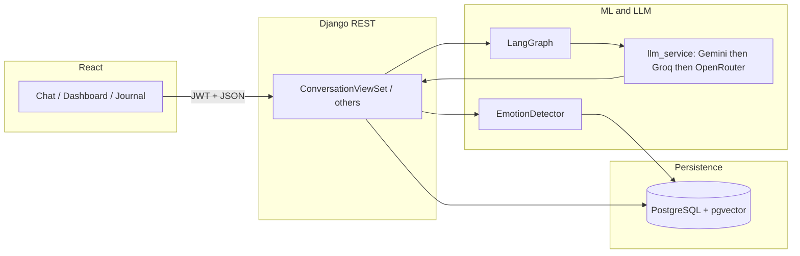

# Emotion Chat

Full-stack **emotion-aware** chat: users talk in a WhatsApp-style UI while the backend classifies mood, stores analytics, and replies with an LLM tuned for empathy. Data lives in **PostgreSQL** (with **pgvector** for future vector search), caching and async work use **Redis**, and production serves the React app behind **nginx** with **Daphne** (ASGI).

**Production URL (when configured):** [https://www.myemotionaichatbot.duckdns.org](https://www.myemotionaichatbot.duckdns.org)

---

## What the app does

- **Chat** — Conversations and messages per user; first message can auto-title the thread; reply-to context is sent to the model as quoted “replying to …” text.
- **Emotion layer** — Each user message is scored into buckets (`happy`, `sad`, `anxious`, `angry`, `neutral`); results are saved for dashboards and journaling.
- **Long-term memory** — Lightweight rules extract names and “remember that …” facts into `UserChatMemory` so the LLM gets consistent context across chats.
- **Dashboard** — Aggregates emotion stats, mood trends, timelines, and weekly/monthly reports from stored analyses.
- **Journal** — Entries and AI-backed insights over time (see `journal/`).
- **Guest demo** — Visitors without JWTs can use a **local demo** chat (no server); signing in switches to real API-backed threads.

---

## Tech stack

| Area | Choices |
|------|---------|
| Backend | Django, Django REST Framework, **SimpleJWT** (access + refresh, rotation + blacklist) |
| Realtime | **Daphne** + **Django Channels** (ASGI); **Redis** channel layer when `REDIS_URL` is set; WebSocket routes are currently empty placeholders |
| Database | **PostgreSQL** + **pgvector** (Django ORM integration) |
| Cache / broker | **Redis** via `django-redis` (optional); **Celery** for background tasks |
| ML (local CPU) | **PyTorch**, **transformers** (DistilRoBERTa emotion classifier), **sentence-transformers** (optional embeddings; off by default for chat latency) |
| LLM (remote) | **Gemini**, **Groq**, **OpenRouter** REST APIs with fallback order and free-tier model lists (`services/llm_service.py`) |
| Orchestration | **LangGraph** wraps “prepare context → generate” so you can extend the graph without changing views (`chat/langgraph_chat.py`; disable with `USE_LANGGRAPH_CHAT=0`) |
| Frontend | **Create React App**, **React Router**, **axios**, **Tailwind CSS**, **Framer Motion**, **Recharts** (dashboard charts) |

---

## Repository structure

```text
chat_bot/
├── .venv/                        # Python venv (recommended: create at repo root — matches Azure VM layout)
├── emotion_chat/                 # Django app root (manage.py lives here)
│   ├── manage.py
│   ├── .env                      # local secrets (gitignored); copy from .env.example
│   ├── requirements.txt
│   ├── emotion_chat/             # project package: settings, urls, asgi, wsgi, celery, routing
│   ├── accounts/               # JWT login/register, user profile API
│   ├── chat/                   # conversations, messages, LangGraph, user memory, daily mood
│   ├── emotions/               # EmotionDetector, EmotionAnalysis model, summary API
│   ├── journal/              # journal entries, AI insights, digest helpers
│   ├── dashboard/            # emotion_stats, mood_trend, mood_timeline, reports
│   └── services/             # llm_service (multi-provider chat), shared HTTP/keys
├── frontend/                   # React SPA
│   ├── src/
│   │   ├── pages/              # Home, Login, Register, Chat, Journal, Dashboard
│   │   ├── components/         # Navbar, Sidebar, chat UI, landing sections
│   │   ├── context/            # Auth, theme
│   │   ├── hooks/              # useAuth, useTheme
│   │   ├── services/           # api.js — axios + JWT refresh
│   │   └── ...
│   ├── .env.production.example # REACT_APP_API_URL for production builds
│   └── package.json
├── deploy/                     # nginx site + systemd unit *examples* (paths need editing)
├── scripts/                    # optional local helpers (e.g. dev-local.ps1 on Windows)
└── .github/workflows/          # CI (migrations, frontend build) + optional SSH deploy
```

### Local PC and Azure VM — same project layout

The code in this repo is the single source of truth. **Only the absolute path to the clone differs** (e.g. Windows `C:\Users\pradi\Downloads\NILESH\chat_bot` vs Linux `/home/azureuser/chatbot_emotion_detector`). Everything below should match between your machine and the VM:

| | **VM (production)** | **Local PC (development)** |
|---|---------------------|----------------------------|
| **Repo root** | `$DEPLOY_ROOT` (GitHub variable; e.g. `/home/azureuser/chatbot_emotion_detector`) | Your clone folder, e.g. `...\chat_bot` |
| **Python venv** | `$DEPLOY_ROOT/.venv` | **Same:** `.venv` next to `emotion_chat/` and `frontend/` |
| **Install deps** | `pip install -r emotion_chat/requirements.txt` (venv activated) | Same |
| **Django / `.env`** | `emotion_chat/manage.py` and `emotion_chat/.env` | Same paths |
| **Postgres + Redis** | Docker or host install; `DB_*` + `REDIS_URL` in `.env` | `cd emotion_chat` → `docker compose up -d` (see `emotion_chat/docker-compose.yml`) |
| **ASGI process** | **Daphne** on `127.0.0.1:8000`, **systemd** from `deploy/systemd/daphne.service.example` | `runserver` or `daphne -b 127.0.0.1 -p 8000 emotion_chat.asgi:application` from `emotion_chat/` |
| **Frontend dev** | Built on deploy: `REACT_APP_API_URL` = public site URL | `npm start` in `frontend/`; CRA **proxy** → `http://127.0.0.1:8000` |
| **nginx (VM only)** | SPA `root` e.g. `/var/www/emotion-chat/html`; **`/static/js/`** and **`/static/css/`** from the React **build** must be configured **before** Django’s **`/static/`** (see `deploy/nginx/myemotionaichatbot.duckdns.org.conf`) | Not required locally unless you test nginx on WSL |

**Production URL:** [https://www.myemotionaichatbot.duckdns.org](https://www.myemotionaichatbot.duckdns.org) — set `ALLOWED_HOSTS`, `CORS_ALLOWED_ORIGINS`, and `CSRF_TRUSTED_ORIGINS` in `emotion_chat/.env` to include this host (see `emotion_chat/.env.example`).

---

## API surface (high level)

All JSON APIs are under `/api/` (in production, nginx typically exposes the same host so the SPA calls `/api/...` or a full `REACT_APP_API_URL`).

| Prefix | Purpose |
|--------|---------|
| `/api/auth/` | `token/`, `token/refresh/`, `register/`, `profile/` (ViewSet) |
| `/api/chat/` | `conversations/` (CRUD + `send_message`, `messages`), legacy `llm/` test endpoint |
| `/api/emotions/` | `summary/` — aggregates for the current user |
| `/api/journal/` | `entries/`, `insights/` ViewSets |
| `/api/dashboard/` | `emotion_stats/`, `mood_trend/`, `mood_timeline/`, `weekly_report/`, `monthly_report/` |

Django admin: `/admin/`.

---

## End-to-end request flow

1. **Browser** loads the React app (landing, or `/chat` after demo bootstrap).
2. **Authenticated** requests attach `Authorization: Bearer <access>`; **axios** refreshes tokens on `401` via `/api/auth/token/refresh/`.
3. **Send message** (logged-in): `POST /api/chat/conversations/{id}/send_message/` with `{ "content": "..." }`.
4. **Server** (`chat/views.py`): saves user message → runs **emotion detection** → writes `EmotionAnalysis` → (async) **daily mood** update → **extract/merge memory** → builds short **history** + **memory_context** → **LangGraph** → **`get_llm_response`** → saves bot message → returns serialized thread.
5. **Dashboard / journal** read the same stored analyses and messages to chart trends and generate copy.



---

## Backend flow (detail)

- **Settings** (`emotion_chat/settings.py`): loads `.env` via **python-decouple** / **dotenv**; configures Postgres, CORS, CSRF trusted origins, JWT lifetimes, optional Redis cache, Celery broker, Channels layer, logging, and production proxy/TLS flags (`TRUST_PROXY_SSL`, etc.).
- **Auth** (`accounts/`): standard user model extensions as implemented; JWT pair endpoint for SPA login; registration and profile PATCH patterns.
- **Chat** (`chat/`):
  - Models: `Conversation`, `Message`, empathy-related fields, `UserChatMemory`, agent state (see migrations).
  - **User memory** (`user_memory.py`): pattern-based updates from each user utterance; context string passed into the LLM.
  - **Daily mood** (`daily_mood.py`): updated after messages (can run in a background thread on commit).
- **Emotions** (`emotions/`): exposes summary endpoints; **detector** used as a library from chat views.
- **Journal** (`journal/`): CRUD + AI insight endpoints backed by models and helpers like `journal_ai_insights.py`, `daily_digest.py`.
- **Dashboard** (`dashboard/`): read-mostly analytics from aggregated emotion data.
- **ASGI** (`asgi.py`): HTTP handled by Django; **WebSocket** stack is wired but `routing.websocket_urlpatterns` is empty until you add consumers.

---

## ML and LLM flow

### Emotion detection (`emotions/emotion_detector.py`)

- **Goal:** Map text into five buckets for UX, storage, and empathic prompting.
- **Fast path:** Keyword heuristics can short-circuit before loading heavy models (threshold `EMOTION_FAST_KEYWORD_THRESHOLD`).
- **Classifier:** Hugging Face **DistilRoBERTa** (`j-hartmann/emotion-english-distilroberta-base`) maps fine labels into the five buckets.
- **Embeddings:** **sentence-transformers** / `all-mpnet-base-v2` can produce a **768-d vector** stored on `EmotionAnalysis` when `EMOTION_COMPUTE_EMBEDDING=1` (default **off** for chat speed).
- **Optional:** `EMOTION_LLM_REFINE=1` can ask an LLM to fix edge-case labels (extra latency).
- **Heuristic refine:** Adjusts obvious mismatches (e.g. frustrated text labeled happy) without an LLM.

### LLM generation (`services/llm_service.py`)

- **Input:** User text, **primary_emotion**, recent **history**, optional **memory_context**.
- **Prompting:** System/user messages built for empathetic tone (`chat/empathy_prompts.py`).
- **Providers:** Tries **Gemini** first, then **Groq**, then **OpenRouter**, iterating configured free model lists until one succeeds. Keys: `GEMINI_API_KEY` or `GOOGLE_API_KEY`, `GROQ_API_KEY`, `OPENROUTER_API_KEY` (see `.env.example`).
- **Tuning:** `CHAT_MAX_TOKENS`, `LLM_HTTP_TIMEOUT`, `LLM_MAX_CONTEXT_CHARS`, per-provider env vars as documented in code.

### LangGraph (`chat/langgraph_chat.py`)

- Small graph: **prepare_context** → **generate** (calls `get_llm_response`). Useful if you add retrieval, tools, or branching later. Set **`USE_LANGGRAPH_CHAT=0`** to call the LLM helper directly without compiling the graph.

---

## Frontend flow

- **Routing** (`App.js`): public `/`, `/login`, `/register`, `/chat`; protected `/journal`, `/dashboard`.
- **API client** (`services/api.js`): `baseURL` from `REACT_APP_API_URL` (empty in dev = same-origin + CRA **proxy** to `http://127.0.0.1:8000`). Attaches JWT and handles refresh.
- **Auth** (`AuthContext`, `useAuth`): stores tokens in **localStorage**; **demo user** path for `/chat` without backend (`ChatPage.jsx` + `enableDemoUser`).
- **UI:** WhatsApp-inspired chat (`ChatInterface`, `MessageList`, …), landing components (`Aero*`), dashboard charts (**Recharts**), theme toggle (**ThemeContext**).

---

## Environment configuration

Copy **`emotion_chat/.env.example`** → **`emotion_chat/.env`** and set at least:

- **Django:** `SECRET_KEY`, `DEBUG`, `ALLOWED_HOSTS`, `CSRF_TRUSTED_ORIGINS`, `CORS_ALLOWED_ORIGINS`
- **Database:** `DB_*`
- **Redis (recommended production):** `REDIS_URL` — enables Channels layer and Django cache; Celery defaults
- **LLM:** one or more of `GEMINI_API_KEY` / `GOOGLE_API_KEY`, `GROQ_API_KEY`, `OPENROUTER_API_KEY`
- **Production behind nginx:** `TRUST_PROXY_SSL=1`, etc. (see example file)

Frontend production build: copy **`frontend/.env.production.example`** → **`frontend/.env.production`** or set `REACT_APP_API_URL` in CI — e.g. `https://www.myemotionaichatbot.duckdns.org`.

---

## Local development

Use the **same tree as the VM**: open your **repository root** (folder that contains `emotion_chat/` and `frontend/`), not only the inner `emotion_chat` folder.

**1. Postgres + Redis (same stack as `docker compose` on a typical VM)**

From `emotion_chat/`:

```bash
docker compose up -d
```

**2. Backend — venv at repo root (same as VM: `$DEPLOY_ROOT/.venv`)**

```bash
cd chat_bot                    # your repo root (name may differ, e.g. chat_bot)
python -m venv .venv
# Windows PowerShell:
.\.venv\Scripts\Activate.ps1
# Windows cmd:
#   .venv\Scripts\activate.bat
# Linux/macOS:
#   source .venv/bin/activate

pip install -r emotion_chat/requirements.txt
cd emotion_chat
copy .env.example .env        # Windows: or `cp` on Linux; edit DB_* / REDIS_URL / keys
python manage.py migrate
python manage.py runserver
```

For ASGI parity with production: `daphne -b 127.0.0.1 -p 8000 emotion_chat.asgi:application` from `emotion_chat/` with the same venv activated.

**Optional (Windows):** `scripts\dev-local.ps1` creates/uses `.\.venv`, installs deps, and starts `runserver` if Docker is already up.

**3. Frontend**

```bash
cd frontend
npm ci
npm start
```

CRA **`proxy`** forwards `/api` to `http://127.0.0.1:8000`. **Machine learning models** download on first use (Hugging Face / sentence-transformers); ensure disk and network allow that.

---

## Production (Azure VM + DuckDNS)

Aligns with the **“Local PC and Azure VM”** table above: same repo, venv at **`$DEPLOY_ROOT/.venv`**, **`emotion_chat/.env`**, Daphne + nginx.

1. **DNS:** Point **DuckDNS** at the VM; support **www** and apex if you use both.
2. **TLS:** e.g. `certbot --nginx -d www.myemotionaichatbot.duckdns.org -d myemotionaichatbot.duckdns.org`
3. **Postgres + Redis** on the VM or managed services; fill `emotion_chat/.env` (same keys as locally; production uses `DEBUG=False`, `TRUST_PROXY_SSL=1` behind nginx).
4. **Static/media:** `collectstatic`; nginx `alias` paths for `STATIC_ROOT` and `MEDIA_ROOT` (see `deploy/nginx/` — replace **`REPLACE_USER`** with your Linux user). Serve **CRA** `/static/js/` and `/static/css/` from the **React build** before Django’s `/static/` (see `deploy/nginx/myemotionaichatbot.duckdns.org.conf`).
5. **Processes:** **Daphne** on `127.0.0.1:8000`; **systemd** units use **`$DEPLOY_ROOT/.venv`** — see `deploy/systemd/daphne.service.example` (adjust **`REPLACE_USER`** and **`chat_bot`** to your clone directory name). **Celery** optional; see `deploy/systemd/celery-worker.service.example`.
6. **Frontend:** `npm run build` with `REACT_APP_API_URL=https://www.myemotionaichatbot.duckdns.org`; deploy `frontend/build/` to nginx `root` (e.g. `/var/www/emotion-chat/html`).

## Further reading in the repo

- Emotion emoji mapping: `emotion_chat/emotions/emotion_emojis.py`
- Seed data (optional): `chat/management/commands/seed_demo_data.py`
- Empathy system prompt construction: `chat/empathy_prompts.py`
